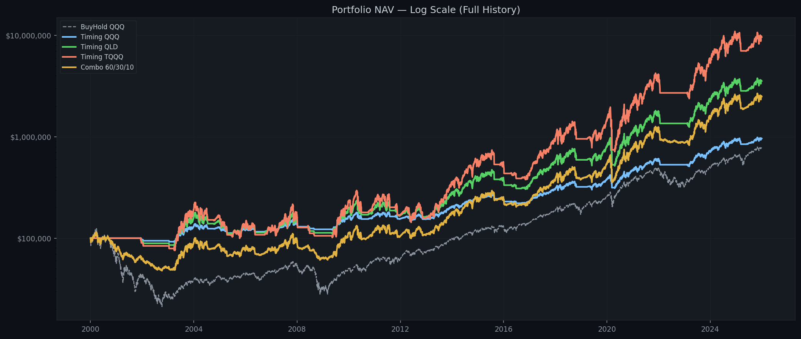
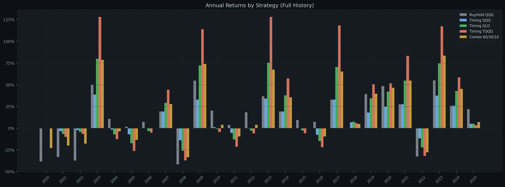
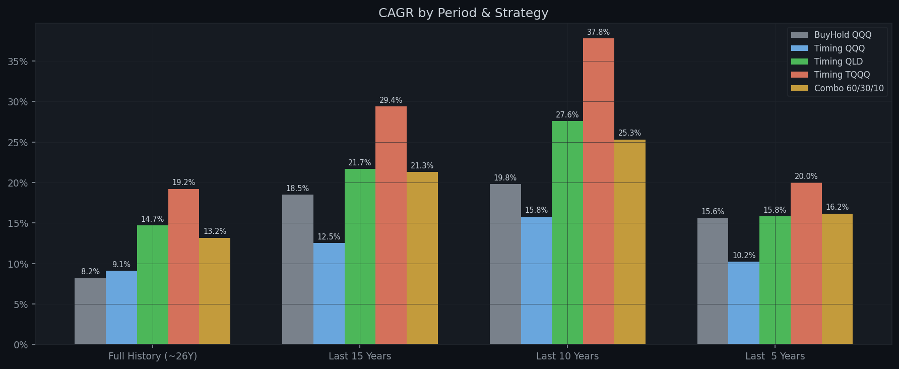

# Quant-QQQ-QLD-TQQQ-SMA200Timing-MixedPosition-Backtest

A production-grade quantitative backtest comparing five investment strategies using QQQ's 200-day simple moving average (SMA200) as the market regime signal, with dip-based DCA entry and a blended combo portfolio.

基于 QQQ 200 日简单移动均线（SMA200）判断牛熊市，对比五种投资策略的量化回测框架，支持分批回调建仓与混合组合配置。

---

## Strategies / 策略说明

| # | Name / 名称 | Description / 说明 |
|---|---|---|
| 1 | **BuyHold QQQ** | 100% QQQ, no timing / 买入持有，不择时 |
| 2 | **Timing QQQ** | QQQ + SMA200 timing + dip DCA / QQQ择时+回调分批建仓 |
| 3 | **Timing QLD** | QLD (2×) + SMA200 timing + dip DCA / 2倍杠杆择时 |
| 4 | **Timing TQQQ** | TQQQ (3×) + SMA200 timing + dip DCA / 3倍杠杆择时 |
| 5 | **Combo 60/30/10** | 60% QQQ buy-hold + 30% QLD timing + 10% TQQQ timing |

Strategies 2–5 share the same SMA200 signal and DCA parameters.  
策略 2–5 共用相同的 SMA200 信号和分批建仓参数。

---

## Signal Logic / 信号逻辑

| Signal / 信号 | Condition / 条件 | Action / 操作 |
|---|---|---|
| Bull confirmed / 牛市确认 | `QQQ > SMA200 × 1.03` | DCA entry / 分批买入 |
| Bear confirmed / 熊市确认 | `QQQ < SMA200 × 0.83` | Full exit / 一次性清仓 |
| Dip trigger / 回调触发 | QQQ daily return ≤ −1% | One tranche / 买入一批 |

Each tranche = `1/max_tranches` of current total equity. Final tranche = all remaining cash.  
每批买入当前总权益的 `1/max_tranches`，最后一批用完全部剩余现金。

---

## Data / 数据处理

| Ticker | Real Data From / 真实数据起点 | Pre-inception / 上市前处理 |
|--------|---|---|
| QQQ  | 1999-03-10 | — |
| QLD  | 2006-06-21 | Synthetic 2× QQQ / 合成2倍QQQ |
| TQQQ | 2010-02-09 | Synthetic 3× QQQ / 合成3倍QQQ |

Synthetic leverage formula / 合成公式:  
`leveraged_return = qqq_daily_return × N − daily_cost`  
`daily_cost = (1 + annual_cost)^(1/252) − 1`  
(QLD: 4% annual cost, TQQQ: 6% annual cost)

---

## Backtest Results / 回测结果

> Initial capital $100,000 | Buy ×1.03 | Sell ×0.83 | SMA200 | Tranches 5 | Dip −1%  
> 初始资金 $100,000 | 买入阈值 ×1.03 | 卖出阈值 ×0.83 | SMA200 | 分5批 | 回调幅度 −1%

### Full History ~26 Years (2000–2025) / 全历史约26年

| Strategy | Total Return | Final Value | CAGR | Max DD | Sharpe | In Market |
|---|---:|---:|---:|---:|---:|---:|
| **BuyHold QQQ** | +674.01% | $774,014 | +8.19% | -82.96% | 0.28 | 100.0% |
| **Timing QQQ** | +2745.29% | $2,845,287 | +13.75% | -32.32% | 0.59 | 82.1% |
| **Timing QLD** | +17651.78% | $17,751,784 | +22.05% | -60.58% | 0.63 | 82.1% |
| **Timing TQQQ** | +68031.84% | $68,131,836 | +28.53% | -76.37% | 0.67 | 82.1% |
| **Combo 60/30/10** | +12503.13% | $12,603,127 | +20.45% | -62.55% | 0.57 | 82.1% |

### Last 15 Years (2011–2025) / 近15年

| Strategy | Total Return | Final Value | CAGR | Max DD | Sharpe | In Market |
|---|---:|---:|---:|---:|---:|---:|
| **BuyHold QQQ** | +1176.81% | $1,276,808 | +18.52% | -35.12% | 0.73 | 100.0% |
| **Timing QQQ** | +948.51% | $1,048,513 | +16.97% | -28.71% | 0.73 | 89.5% |
| **Timing QLD** | +4461.80% | $4,561,798 | +29.03% | -51.98% | 0.77 | 89.5% |
| **Timing TQQQ** | +12762.81% | $12,862,805 | +38.27% | -69.92% | 0.80 | 89.5% |
| **Combo 60/30/10** | +3320.90% | $3,420,905 | +26.57% | -53.13% | 0.74 | 89.5% |

### Last 10 Years (2016–2025) / 近10年

| Strategy | Total Return | Final Value | CAGR | Max DD | Sharpe | In Market |
|---|---:|---:|---:|---:|---:|---:|
| **BuyHold QQQ** | +508.21% | $608,205 | +19.81% | -35.12% | 0.74 | 100.0% |
| **Timing QQQ** | +445.73% | $545,729 | +18.52% | -28.71% | 0.75 | 84.0% |
| **Timing QLD** | +1363.68% | $1,463,676 | +30.82% | -51.98% | 0.78 | 84.0% |
| **Timing TQQQ** | +2636.19% | $2,736,194 | +39.28% | -69.92% | 0.79 | 84.0% |
| **Combo 60/30/10** | +977.65% | $1,077,645 | +26.87% | -48.40% | 0.75 | 84.0% |

### Last 5 Years (2021–2025) / 近5年

| Strategy | Total Return | Final Value | CAGR | Max DD | Sharpe | In Market |
|---|---:|---:|---:|---:|---:|---:|
| **BuyHold QQQ** | +106.36% | $206,364 | +15.64% | -35.12% | 0.58 | 100.0% |
| **Timing QQQ** | +55.99% | $155,991 | +9.33% | -28.71% | 0.37 | 67.9% |
| **Timing QLD** | +73.80% | $173,798 | +11.72% | -51.60% | 0.38 | 67.9% |
| **Timing TQQQ** | +68.99% | $168,990 | +11.10% | -68.32% | 0.39 | 67.9% |
| **Combo 60/30/10** | +92.86% | $192,857 | +14.08% | -41.15% | 0.48 | 67.9% |

---

## Annual Returns / 逐年收益

| Year | BuyHold QQQ | Timing QQQ | Timing QLD | Timing TQQQ | Combo 60/30/10 |
|---|---:|---:|---:|---:|---:|
| 2000 | -38.4% | 0.0% | 0.0% | 0.0% | -23.0% |
| 2001 | -33.3% | 0.0% | 0.0% | 0.0% | -16.0% |
| 2002 | -37.4% | 0.0% | 0.0% | 0.0% | -14.2% |
| 2003 | +49.7% | +41.1% | +86.4% | +140.7% | +86.0% |
| 2004 | +10.5% | +10.5% | +14.0% | +16.5% | +13.8% |
| 2005 | +1.6% | +1.6% | -2.5% | -6.2% | -2.5% |
| 2006 | +7.1% | +7.1% | +6.4% | +7.9% | +6.9% |
| 2007 | +19.0% | +19.0% | +29.0% | +44.1% | +30.3% |
| 2008 | -41.7% | -26.1% | -52.2% | -67.8% | -54.0% |
| 2009 | +54.7% | +27.0% | +58.7% | +91.6% | +63.5% |
| 2010 | +20.1% | +20.1% | +36.9% | +51.6% | +35.8% |
| 2011 | +3.5% | +3.5% | 0.0% | -8.0% | -1.1% |
| 2012 | +18.1% | +18.1% | +34.8% | +52.3% | +34.8% |
| 2013 | +36.6% | +36.6% | +82.1% | +139.7% | +87.2% |
| 2014 | +19.2% | +19.2% | +37.6% | +57.1% | +41.0% |
| 2015 | +9.4% | +9.4% | +14.7% | +17.2% | +15.0% |
| 2016 | +7.1% | +7.1% | +10.0% | +11.4% | +10.2% |
| 2017 | +32.7% | +32.7% | +70.3% | +118.1% | +83.3% |
| 2018 | -0.1% | -0.1% | -8.3% | -19.8% | -12.6% |
| 2019 | +39.0% | +39.0% | +81.7% | +133.8% | +98.3% |
| 2020 | +48.4% | +48.4% | +88.9% | +110.1% | +96.1% |
| 2021 | +27.4% | +27.4% | +54.7% | +83.0% | +67.5% |
| 2022 | -32.6% | -25.3% | -46.6% | -63.3% | -55.2% |
| 2023 | +54.9% | +34.5% | +68.1% | +105.6% | +84.2% |
| 2024 | +25.6% | +25.6% | +42.8% | +58.3% | +49.7% |
| 2025 | +21.8% | +21.8% | +32.6% | +37.9% | +34.9% |

---

## Charts / 图表

Full detailed charts are in the [`reports/`](reports/) folder and auto-updated weekly by CI.  
完整图表在 [`reports/`](reports/) 目录，由 CI 每周自动更新。

### NAV Comparison / 净值曲线对比


### Drawdown Comparison / 回撤对比


### Annual Returns / 逐年收益柱状图


### CAGR by Period / 各时间段年化收益


### Sharpe by Period / 各时间段夏普比率


---

## Project Structure / 项目结构

```
## 📂 项目结构 (Project Structure)

```text
Quant-QQQ-QLD-TQQQ-SMA200Timing-MixedPosition-Backtest/
│
├── strategies/
│   └── engine.py                 # Core strategy engine (shared by US & CSI300)
│                                 # 策略核心引擎（美股和沪深300共用）
│                                 # - 5 strategies, signal generator, DCA logic
│                                 # - Synthesis for QLD/TQQQ/2x-CSI/3x-CSI
│
├── data/
│   ├── downloader.py             # yfinance + akshare + Parquet cache
│   │                             # 数据下载与缓存（美股用yfinance，A股用akshare）
│   └── cache/                    # Auto-generated / 自动生成，已 git-ignore
│       ├── QQQ.parquet
│       ├── QLD.parquet
│       ├── TQQQ.parquet
│       └── SH000300.parquet
│
├── backtest/                     # Backtest runners & optimisers
│   ├── run.py                    # US: 5-strategy multi-period backtest
│   │                             # 美股：五策略多时间段回测
│   ├── run_csi300.py             # CSI300: 4-strategy multi-period backtest
│   │                             # 沪深300：四策略多时间段回测
│   ├── optimize.py               # US: parallel grid search (buy/sell/MA)
│   │                             # 美股：并行网格搜索
│   └── optimize_csi300.py        # CSI300: parallel grid search, last-10Y eval
│                                 # 沪深300：并行网格搜索，近10年评估
│
├── reports/                      # Generated outputs / 生成的回测结果
│   ├── results.md                # US full backtest report
│   ├── 1_nav_comparison.png      # US charts
│   ├── 2_drawdowns.png
│   ├── 3_annual_returns.png
│   ├── 4_cagr_by_period.png
│   ├── 5_sharpe_by_period.png
│   ├── optimize/                 # US optimisation outputs
│   │   ├── optimize_tqqq_.csv
│   │   ├── optimize_combo_.csv
│   │   └── heatmap.png
│   │
│   └── csi300/                   # CSI300 outputs
│       ├── csi300_results.md
│       ├── csi_1_nav.png
│       ├── csi_2_drawdowns.png
│       ├── csi_3_annual.png
│       ├── csi_4_cagr.png
│       └── optimize/
│           ├── optimize_csi3x.csv
│           ├── optimize_csicombo_*.csv
│           └── *_heatmap.png
│
├── tests/
│   └── test_strategies.py        # Unit tests (pytest)
│
├── .github/
│   └── workflows/
│       └── ci.yml                # Lint → Test → Weekly backtest
│
├── requirements.txt
├── pyproject.toml                # ruff + mypy + pytest config
├── .gitignore
└── README.md
```
### File Roles at a Glance / 文件职责速览

| Category / 分类 | Files / 文件 | Purpose / 用途 |
|---|---|---|
| **Engine / 引擎** | `strategies/engine.py` | All strategy logic, reusable across markets |
| **Data / 数据** | `data/downloader.py` | yfinance (US) + akshare (A-share) + caching |
| **Backtest / 回测** | `backtest/run.py` + `run_csi300.py` | Multi-period performance comparison |
| **Optimise / 优化** | `backtest/optimize.py` + `optimize_csi300.py` | Grid search for buy/sell/MA parameters |
| **Reports / 报告** | `reports/` | Tables, charts, heatmaps, markdown summaries |

---

## Quick Start / 快速开始

```bash
conda create -n quant python=3.11 -y
conda activate quant
pip install -r requirements.txt

python backtest/run.py                                      # default / 默认参数
python backtest/run.py --tranches 3 --buy 1.05 --sell 0.96  # custom / 自定义
python backtest/run.py --refresh                            # force reload / 强制重载数据
pytest tests/ -v                                            # run tests / 运行测试
```

## CLI Options / 命令行参数

| Flag | Default | Description / 说明 |
|------|---------|---|
| `--buy`      | `1.03`    | Bull zone threshold / 牛市阈值 |
| `--sell`     | `0.83`    | Bear zone threshold / 熊市阈值 |
| `--ma`       | `200`     | SMA period (days) / 均线周期 |
| `--tranches` | `5`       | DCA tranches: 1=all-in, N=1/N equity / 分批数量 |
| `--dip`      | `-0.01`   | Min QQQ daily return for entry / 入场回调幅度 |
| `--capital`  | `100000`  | Initial capital / 初始资金 |
| `--refresh`  | `False`   | Force re-download data / 强制重新下载 |

---


## Credits / 致谢

Strategy concept inspired by:  
策略思路部分参考自：

> [别再定投 QQQ，这个混合配方才是普通人投资的终极答案！26 年回測結果太驚人](https://www.youtube.com/watch?v=ey7B8NthhpM)

Independent implementation for educational purposes only.  
独立实现，仅供学习研究，不构成任何投资建议。

---

## Risk Warning / 风险提示

QLD and TQQQ are leveraged ETFs subject to volatility decay and large drawdowns (TQQQ max DD exceeded **-80%** historically). **Past backtest results do not guarantee future performance. Not investment advice.**

QLD 和 TQQQ 为杠杆 ETF，存在波动率损耗，历史最大回撤超过 **-80%**。  
**历史回测不代表未来表现，本项目不构成任何投资建议。**

---

## CSI300 Exploration / 沪深300市场扩展

Extended the framework to the Chinese A-share market using **510300.SS (沪深300ETF)** as the base asset, with synthetic 2× and 3× leveraged ETFs (China has no listed leveraged ETFs).

将框架扩展至中国 A 股市场，以 **510300.SS（沪深300ETF）** 为基础资产，合成 2 倍与 3 倍杠杆 ETF（A 股市场无已上市的杠杆 ETF）。

### Strategies / 策略设置

| # | Name / 名称 | Description / 说明 |
|---|---|---|
| 1 | BuyHold CSI300   | 100% 沪深300ETF buy and hold |
| 2 | Timing 2x CSI    | Synthetic 2× + SMA200 timing + dip DCA |
| 3 | Timing 3x CSI    | Synthetic 3× + SMA200 timing + dip DCA |
| 4 | Combo 60/30/10   | 60% CSI buy-hold + 30% 2× timing + 10% 3× timing |

### Data Source / 数据来源

- **Index signal / 信号源**: `sh000300` (沪深300指数) via akshare, from **2005-04-08** (inception)
- **Synthetic cost / 合成磨损**: 2× = 4% annual | 3× = 6% annual
- yfinance 对 A 股数据覆盖不完整（510300.SS 仅到 2012 年），因此改用 **akshare** 拉取沪深300指数数据

### Run / 运行

```bash
python backtest/run_csi300.py                             # default / 默认参数
python backtest/run_csi300.py --buy 1.02 --sell 0.96      # custom thresholds
python backtest/optimize_csi300.py --ma-grid 60 120 200 250  # grid search
```

Outputs saved to `reports/csi300/`.

---

## MA Period Optimisation / 均线周期优化

Extended the grid search to include the **SMA period** as a third optimisation dimension, running in parallel across CPU cores via `multiprocessing`.

将网格搜索扩展到 **均线周期** 作为第三个优化维度，通过 `multiprocessing` 并行执行。

### Why Different MA Periods / 为什么测试不同均线周期

US market conventions use MA200 by default, but A-share research typically uses:

A 股市场研究惯用的均线与美股不同：

| MA | Chinese Name / A股名称 | Interpretation / 含义 |
|---|---|---|
| MA60  | 生死线 / Life-Death Line      | Mid-term trend, favoured by institutions |
| MA120 | 半年线 / Half-Year Line       | Mid-to-long term confirmation line |
| MA200 | — (US convention)             | Cross-market comparability / 跨市场可比性 |
| MA250 | 年线 / Yearly Bull-Bear Line  | A-share's consensus bull-bear divider |

### Grid Search / 网格搜索

Parameters tested:
- Buy threshold: `1.00 → 1.20` (step 0.01, 21 values)
- Sell threshold: `1.00 → 0.70` (step 0.01, 31 values)
- MA periods: `[60, 120, 180, 200, 240, 250]`
- Total: **3,906 combinations** per run

Parallel execution on 16 CPU cores completes in ~30–60 seconds.

```bash
# US market
python backtest/optimize.py --ma-grid 100 150 200 250

# CSI300 market (uses last 10Y as evaluation window)
python backtest/optimize_csi300.py --ma-grid 60 120 180 200 240 250
```

### Key Findings / 关键发现

#### US Market (QQQ/QLD/TQQQ) / 美股市场

Optimal parameters maximising full-history total return:

| Strategy | Buy | Sell | MA | Note |
|---|---:|---:|---:|---|
| Timing TQQQ    | **1.03** | **0.83** | **200** | Default MA200 remains optimal |
| Combo 60/30/10 | **1.03** | **0.83** | **200** | Same optimum as TQQQ |

Both strategies converge on the same threshold pair — a tight bull entry (`×1.03`) combined with a deeper bear exit (`×0.83`). The wider sell gap significantly reduces drawdown versus the default `0.97`.

两种策略收敛于同一最优参数对：较窄的牛市入场缓冲（`×1.03`）配合更深的熊市离场阈值（`×0.83`）。更宽的卖出间距相比默认 `0.97` 显著降低回撤。

#### CSI300 Market / 沪深300市场

Evaluation window: **last 10 years (2015–2025)**.

| Strategy | Buy | Sell | MA | Note |
|---|---:|---:|---:|---|
| Timing 3x CSI    | **1.01** | **0.96** | **250** | Matches A-share yearly line (年线) |
| Combo 60/30/10   | **1.01** | **0.96** | **240** | Close to yearly line, slightly shorter |

Both strategies converge on the same threshold pair (`buy ×1.01 / sell ×0.96`), which is notably **tighter** than the US market optimum (`1.03 / 0.83`). The optimal MA period lands on ~250 days — aligning with A-share tradition where **MA250 (年线) is the consensus bull-bear divider**, unlike the US market's MA200 convention.

两种策略收敛于同一最优阈值对（`买入 ×1.01 / 卖出 ×0.96`），明显**比美股更窄**（美股为 `1.03 / 0.83`）。最优均线周期落在约 250 日，正好对应 A 股传统的**年线（MA250）牛熊分界线**，与美股惯用的 MA200 不同。

> **Why last 10 years / 为什么用近 10 年优化**
>
> The 2007 bull market and 2015 leveraged bull-bear cycle produced extreme returns (e.g. synthetic 3× CSI returned >20,000% in 2007 alone) that distort any full-history optimisation. Post-2016, A-share market structure changed significantly — stock-connect inflows, institutional rise, and deleveraging reforms — making the recent decade more representative of forward-looking strategy performance.
>
> 2007 年大牛市和 2015 年杠杆牛熊周期产生了极端收益（例如合成 3× 沪深300 在 2007 年单年收益就超过 20,000%），任何基于全历史的优化都会被这段数据严重扭曲。2016 年之后 A 股市场结构发生显著变化——沪港通资金流入、机构化提升、去杠杆改革——近 10 年的表现更能代表策略的前瞻性有效性。
>
> Signals are still computed on the full 2005+ data for MA warm-up, but all performance metrics (total return, CAGR, drawdown, Sharpe) are computed on the post-2015 NAV curve.
> 信号仍基于 2005 年起的完整数据计算以保证均线预热期，但所有性能指标均基于 2015 年后的净值曲线。

Full CSV results and per-MA heatmaps are saved to `reports/optimize/` and `reports/csi300/optimize/`.
