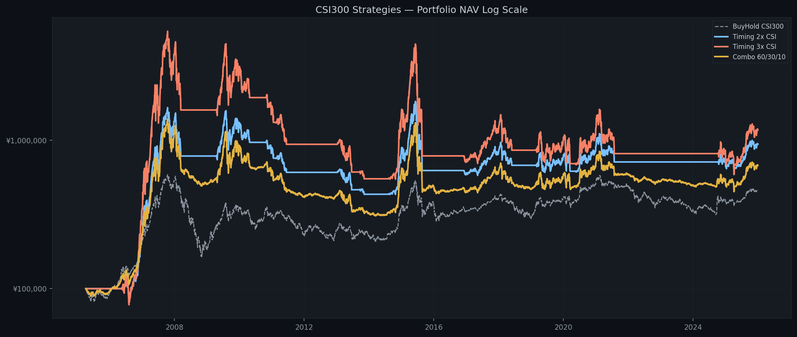
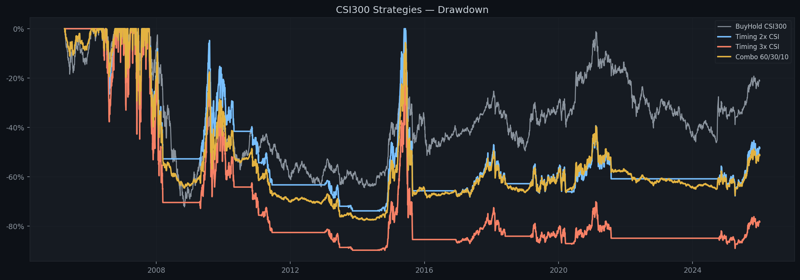
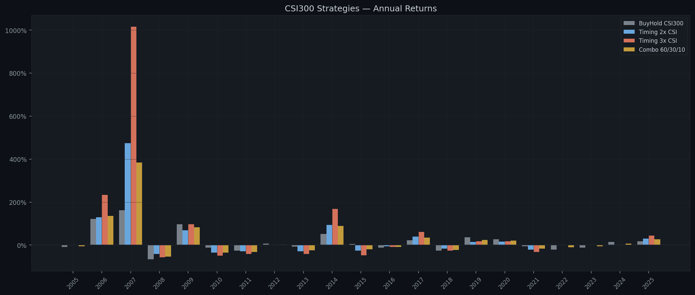
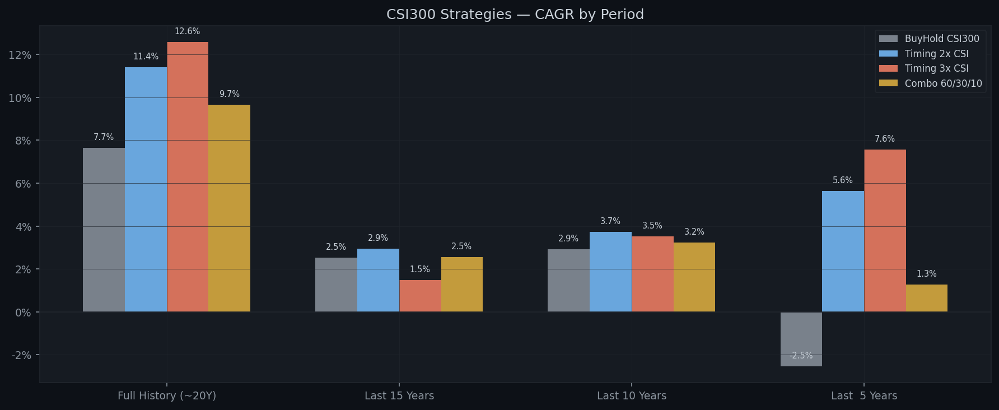

# CSI300 SMA200 Timing Backtest Report / 沪深300 SMA200 择时回测报告

**Generated / 生成日期:** 2026-04-19  
**Signal / 信号:** CSI300 (510300.SS) SMA250  
**Parameters / 参数:** Buy `×1.01` | Sell `×0.96` | Tranches `5` | Dip `-1.0%` | Capital `¥100,000`  
**Synthetic costs / 合成磨损:** 2x ETF `4% annual` | 3x ETF `6% annual`

---

## Performance by Period / 分周期回测结果

### Full History (~20Y)

| Strategy | Total Return | Final Value | CAGR | Max DD | Sharpe | In Market |
|---|---:|---:|---:|---:|---:|---:|
| **BuyHold CSI300** | +361.40% | ¥461,404 | +7.65% | -72.30% | 0.27 | 100.0% |
| **Timing 2x CSI** | +836.70% | ¥936,699 | +11.40% | -73.99% | 0.38 | 48.5% |
| **Timing 3x CSI** | +1067.06% | ¥1,167,058 | +12.58% | -89.90% | 0.43 | 48.5% |
| **Combo 60/30/10** | +574.56% | ¥674,558 | +9.65% | -77.72% | 0.34 | 48.5% |

### Last 15 Years

| Strategy | Total Return | Final Value | CAGR | Max DD | Sharpe | In Market |
|---|---:|---:|---:|---:|---:|---:|
| **BuyHold CSI300** | +45.15% | ¥145,154 | +2.52% | -46.70% | 0.04 | 100.0% |
| **Timing 2x CSI** | +54.43% | ¥154,432 | +2.94% | -68.26% | 0.11 | 44.0% |
| **Timing 3x CSI** | +24.56% | ¥124,562 | +1.48% | -86.71% | 0.16 | 44.0% |
| **Combo 60/30/10** | +45.88% | ¥145,878 | +2.55% | -60.98% | 0.06 | 44.0% |

### Last 10 Years

| Strategy | Total Return | Final Value | CAGR | Max DD | Sharpe | In Market |
|---|---:|---:|---:|---:|---:|---:|
| **BuyHold CSI300** | +33.46% | ¥133,464 | +2.93% | -45.60% | 0.04 | 100.0% |
| **Timing 2x CSI** | +44.30% | ¥144,301 | +3.74% | -46.93% | 0.11 | 47.2% |
| **Timing 3x CSI** | +41.33% | ¥141,333 | +3.52% | -63.47% | 0.17 | 47.2% |
| **Combo 60/30/10** | +37.50% | ¥137,502 | +3.24% | -43.69% | 0.07 | 47.2% |

### Last  5 Years

| Strategy | Total Return | Final Value | CAGR | Max DD | Sharpe | In Market |
|---|---:|---:|---:|---:|---:|---:|
| **BuyHold CSI300** | -12.11% | ¥87,893 | -2.55% | -45.60% | -0.28 | 100.0% |
| **Timing 2x CSI** | +31.45% | ¥131,450 | +5.63% | -27.27% | 0.19 | 25.0% |
| **Timing 3x CSI** | +43.86% | ¥143,861 | +7.56% | -39.39% | 0.27 | 25.0% |
| **Combo 60/30/10** | +6.56% | ¥106,557 | +1.28% | -31.39% | -0.10 | 25.0% |

---

## Annual Returns / 逐年收益

| Year | BuyHold CSI300 | Timing 2x CSI | Timing 3x CSI | Combo 60/30/10 |
|---|---:|---:|---:|---:|
| 2005 | -8.0% | 0.0% | 0.0% | -4.8% |
| 2006 | +121.0% | +130.2% | +233.8% | +135.8% |
| 2007 | +161.5% | +474.4% | +1015.2% | +384.7% |
| 2008 | -65.9% | -40.9% | -57.2% | -53.8% |
| 2009 | +96.7% | +68.3% | +96.8% | +83.5% |
| 2010 | -12.5% | -34.7% | -48.9% | -34.4% |
| 2011 | -25.0% | -29.3% | -41.6% | -31.3% |
| 2012 | +7.6% | 0.0% | 0.0% | +2.5% |
| 2013 | -7.6% | -28.8% | -41.4% | -24.1% |
| 2014 | +51.7% | +94.5% | +168.7% | +88.6% |
| 2015 | +5.6% | -25.7% | -46.9% | -20.0% |
| 2016 | -11.3% | -6.0% | -8.7% | -8.8% |
| 2017 | +21.8% | +39.1% | +61.5% | +35.0% |
| 2018 | -25.3% | -17.1% | -25.9% | -22.1% |
| 2019 | +36.1% | +14.4% | +17.6% | +23.3% |
| 2020 | +27.2% | +16.1% | +18.5% | +21.2% |
| 2021 | -5.2% | -20.7% | -31.9% | -15.7% |
| 2022 | -21.6% | 0.0% | 0.0% | -10.8% |
| 2023 | -11.4% | 0.0% | 0.0% | -5.0% |
| 2024 | +14.7% | +0.9% | +0.3% | +6.5% |
| 2025 | +17.7% | +30.2% | +43.5% | +26.7% |

---

## Charts / 图表

### NAV Comparison (Log Scale) / 净值曲线对比

### Drawdown Comparison / 回撤对比

### Annual Returns / 逐年收益柱状图

### CAGR by Period / 各时间段年化收益

