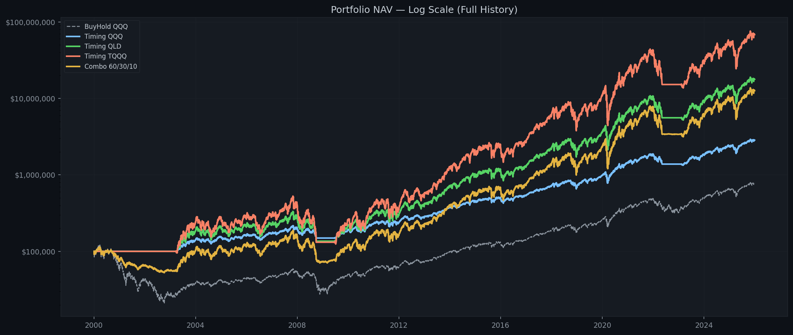
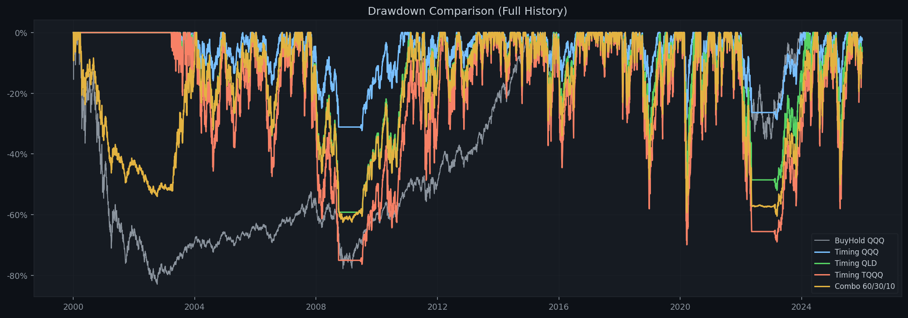
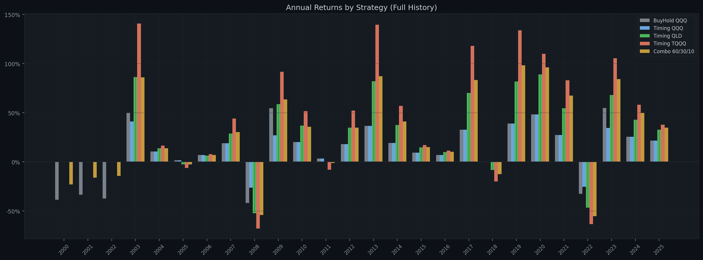
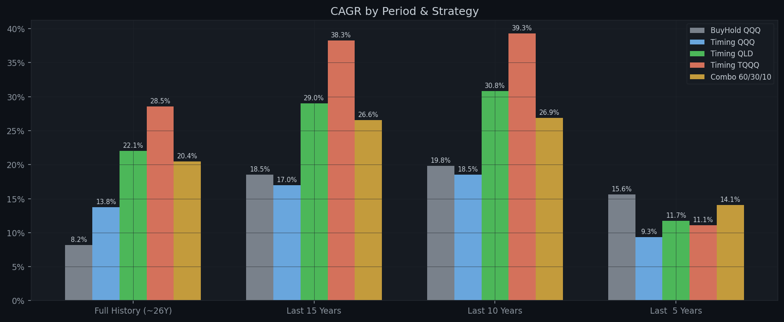
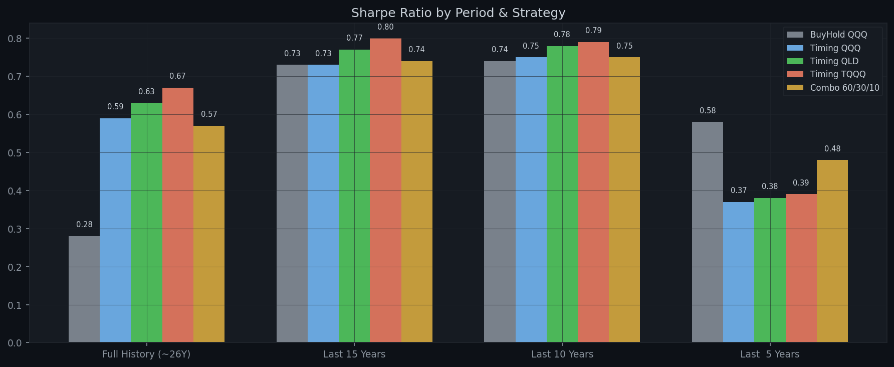

# Multi-Strategy MA200 Backtest Report

**Generated:** 2026-04-18  
**Parameters:** Buy `×1.03` | Sell `×0.83` | MA `200` | Tranches `5` | Dip `-1.0%` | Capital `$100,000`  
**Combo allocation:** QQQ 60% / QLD 30% / TQQQ 10%

---

## Performance Summary / 分周期回测结果

### Full History (~26Y)

| Strategy | Total Return | Final Value | CAGR | Max DD | Sharpe | In Market |
|---|---:|---:|---:|---:|---:|---:|
| **BuyHold QQQ** | +674.01% | $774,014 | +8.19% | -82.96% | 0.28 | 100.0% |
| **Timing QQQ** | +2745.29% | $2,845,287 | +13.75% | -32.32% | 0.59 | 82.1% |
| **Timing QLD** | +17651.78% | $17,751,784 | +22.05% | -60.58% | 0.63 | 82.1% |
| **Timing TQQQ** | +68031.84% | $68,131,836 | +28.53% | -76.37% | 0.67 | 82.1% |
| **Combo 60/30/10** | +12503.13% | $12,603,127 | +20.45% | -62.55% | 0.57 | 82.1% |

### Last 15 Years

| Strategy | Total Return | Final Value | CAGR | Max DD | Sharpe | In Market |
|---|---:|---:|---:|---:|---:|---:|
| **BuyHold QQQ** | +1176.81% | $1,276,808 | +18.52% | -35.12% | 0.73 | 100.0% |
| **Timing QQQ** | +948.51% | $1,048,513 | +16.97% | -28.71% | 0.73 | 89.5% |
| **Timing QLD** | +4461.80% | $4,561,798 | +29.03% | -51.98% | 0.77 | 89.5% |
| **Timing TQQQ** | +12762.81% | $12,862,805 | +38.27% | -69.92% | 0.80 | 89.5% |
| **Combo 60/30/10** | +3320.90% | $3,420,905 | +26.57% | -53.13% | 0.74 | 89.5% |

### Last 10 Years

| Strategy | Total Return | Final Value | CAGR | Max DD | Sharpe | In Market |
|---|---:|---:|---:|---:|---:|---:|
| **BuyHold QQQ** | +508.21% | $608,205 | +19.81% | -35.12% | 0.74 | 100.0% |
| **Timing QQQ** | +445.73% | $545,729 | +18.52% | -28.71% | 0.75 | 84.0% |
| **Timing QLD** | +1363.68% | $1,463,676 | +30.82% | -51.98% | 0.78 | 84.0% |
| **Timing TQQQ** | +2636.19% | $2,736,194 | +39.28% | -69.92% | 0.79 | 84.0% |
| **Combo 60/30/10** | +977.65% | $1,077,645 | +26.87% | -48.40% | 0.75 | 84.0% |

### Last  5 Years

| Strategy | Total Return | Final Value | CAGR | Max DD | Sharpe | In Market |
|---|---:|---:|---:|---:|---:|---:|
| **BuyHold QQQ** | +106.36% | $206,364 | +15.64% | -35.12% | 0.58 | 100.0% |
| **Timing QQQ** | +55.99% | $155,991 | +9.33% | -28.71% | 0.37 | 67.9% |
| **Timing QLD** | +73.80% | $173,798 | +11.72% | -51.60% | 0.38 | 67.9% |
| **Timing TQQQ** | +68.99% | $168,990 | +11.10% | -68.32% | 0.39 | 67.9% |
| **Combo 60/30/10** | +92.86% | $192,857 | +14.08% | -41.15% | 0.48 | 67.9% |

---

## Annual Returns (Full History) / 逐年收益

| Year | BuyHold QQQ | Timing QQQ | Timing QLD | Timing TQQQ | Combo 60/30/10 |
|---|---:|---:|---:|---:|---:|
| 2000 | -38.4% | 0.0% | 0.0% | 0.0% | -23.0% |
| 2001 | -33.3% | 0.0% | 0.0% | 0.0% | -16.0% |
| 2002 | -37.4% | 0.0% | 0.0% | 0.0% | -14.2% |
| 2003 | +49.7% | +41.1% | +86.4% | +140.7% | +86.0% |
| 2004 | +10.5% | +10.5% | +14.0% | +16.5% | +13.8% |
| 2005 | +1.6% | +1.6% | -2.5% | -6.2% | -2.5% |
| 2006 | +7.1% | +7.1% | +6.4% | +7.9% | +6.9% |
| 2007 | +19.0% | +19.0% | +29.0% | +44.1% | +30.3% |
| 2008 | -41.7% | -26.1% | -52.2% | -67.8% | -54.0% |
| 2009 | +54.7% | +27.0% | +58.7% | +91.6% | +63.5% |
| 2010 | +20.1% | +20.1% | +36.9% | +51.6% | +35.8% |
| 2011 | +3.5% | +3.5% | 0.0% | -8.0% | -1.1% |
| 2012 | +18.1% | +18.1% | +34.8% | +52.3% | +34.8% |
| 2013 | +36.6% | +36.6% | +82.1% | +139.7% | +87.2% |
| 2014 | +19.2% | +19.2% | +37.6% | +57.1% | +41.0% |
| 2015 | +9.4% | +9.4% | +14.7% | +17.2% | +15.0% |
| 2016 | +7.1% | +7.1% | +10.0% | +11.4% | +10.2% |
| 2017 | +32.7% | +32.7% | +70.3% | +118.1% | +83.3% |
| 2018 | -0.1% | -0.1% | -8.3% | -19.8% | -12.6% |
| 2019 | +39.0% | +39.0% | +81.7% | +133.8% | +98.3% |
| 2020 | +48.4% | +48.4% | +88.9% | +110.1% | +96.1% |
| 2021 | +27.4% | +27.4% | +54.7% | +83.0% | +67.5% |
| 2022 | -32.6% | -25.3% | -46.6% | -63.3% | -55.2% |
| 2023 | +54.9% | +34.5% | +68.1% | +105.6% | +84.2% |
| 2024 | +25.6% | +25.6% | +42.8% | +58.3% | +49.7% |
| 2025 | +21.8% | +21.8% | +32.6% | +37.9% | +34.9% |

---

## Charts / 图表

### NAV Comparison (Log Scale) / 净值曲线对比（对数坐标）

### Drawdown Comparison / 回撤对比

### Annual Returns by Strategy / 逐年收益柱状图

### CAGR by Period / 各时间段年化收益

### Sharpe by Period / 各时间段夏普比率

