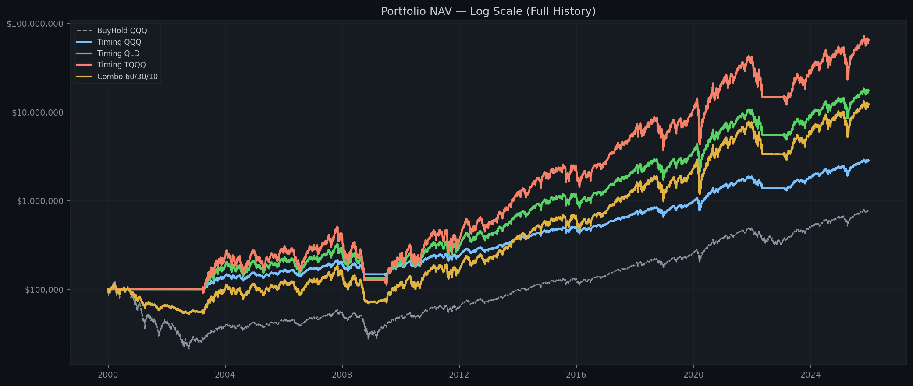
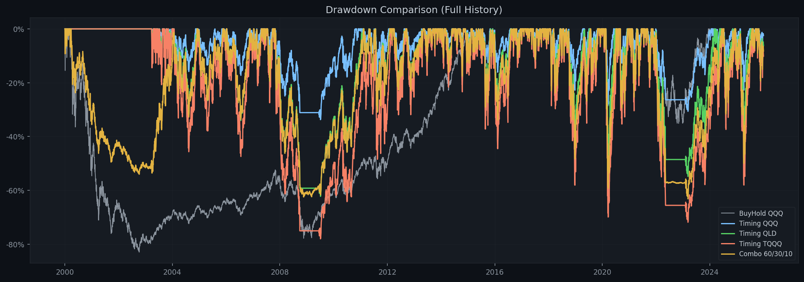
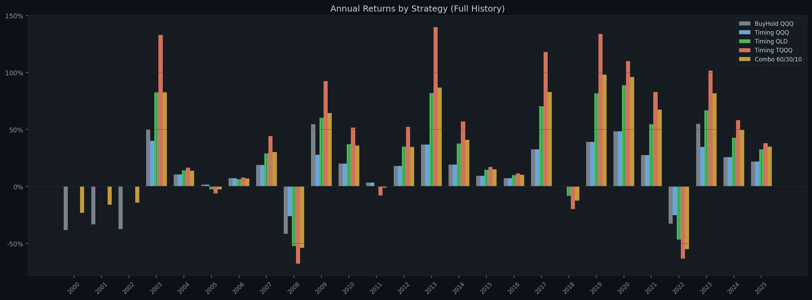
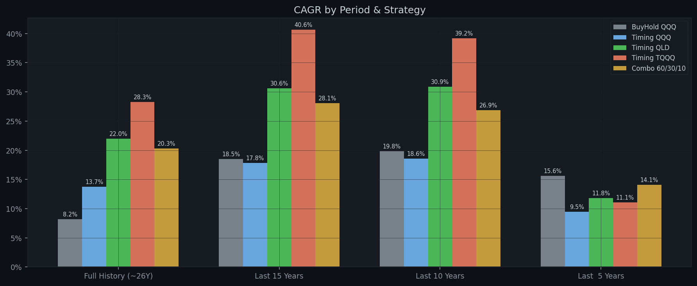
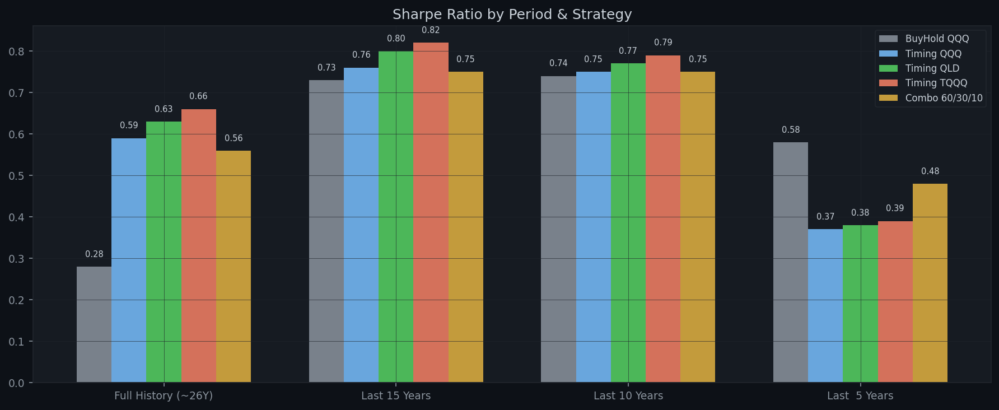

# Multi-Strategy MA200 Backtest Report

**Generated:** 2026-04-18  
**Parameters:** Buy `×1.03` | Sell `×0.83` | MA `200` | Tranches `1` | Dip `-1.0%` | Capital `$100,000`  
**Combo allocation:** QQQ 60% / QLD 30% / TQQQ 10%

---

## Performance Summary / 分周期回测结果

### Full History (~26Y)

| Strategy | Total Return | Final Value | CAGR | Max DD | Sharpe | In Market |
|---|---:|---:|---:|---:|---:|---:|
| **BuyHold QQQ** | +674.01% | $774,014 | +8.19% | -82.96% | 0.28 | 100.0% |
| **Timing QQQ** | +2738.84% | $2,838,839 | +13.74% | -33.74% | 0.59 | 82.1% |
| **Timing QLD** | +17321.12% | $17,421,117 | +21.96% | -62.24% | 0.63 | 82.1% |
| **Timing TQQQ** | +64858.73% | $64,958,732 | +28.30% | -78.03% | 0.66 | 82.1% |
| **Combo 60/30/10** | +12086.62% | $12,186,617 | +20.30% | -63.18% | 0.56 | 82.1% |

### Last 15 Years

| Strategy | Total Return | Final Value | CAGR | Max DD | Sharpe | In Market |
|---|---:|---:|---:|---:|---:|---:|
| **BuyHold QQQ** | +1176.81% | $1,276,808 | +18.52% | -35.12% | 0.73 | 100.0% |
| **Timing QQQ** | +1065.55% | $1,165,545 | +17.80% | -30.65% | 0.76 | 89.5% |
| **Timing QLD** | +5392.26% | $5,492,260 | +30.64% | -54.84% | 0.80 | 89.5% |
| **Timing TQQQ** | +16480.11% | $16,580,112 | +40.63% | -71.86% | 0.82 | 89.5% |
| **Combo 60/30/10** | +3971.77% | $4,071,774 | +28.05% | -56.97% | 0.75 | 89.5% |

### Last 10 Years

| Strategy | Total Return | Final Value | CAGR | Max DD | Sharpe | In Market |
|---|---:|---:|---:|---:|---:|---:|
| **BuyHold QQQ** | +508.21% | $608,205 | +19.81% | -35.12% | 0.74 | 100.0% |
| **Timing QQQ** | +448.86% | $548,856 | +18.59% | -30.65% | 0.75 | 84.0% |
| **Timing QLD** | +1366.75% | $1,466,751 | +30.85% | -54.84% | 0.77 | 84.0% |
| **Timing TQQQ** | +2621.26% | $2,721,262 | +39.20% | -71.86% | 0.79 | 84.0% |
| **Combo 60/30/10** | +977.07% | $1,077,075 | +26.87% | -50.18% | 0.75 | 84.0% |

### Last  5 Years

| Strategy | Total Return | Final Value | CAGR | Max DD | Sharpe | In Market |
|---|---:|---:|---:|---:|---:|---:|
| **BuyHold QQQ** | +106.36% | $206,364 | +15.64% | -35.12% | 0.58 | 100.0% |
| **Timing QQQ** | +57.04% | $157,044 | +9.48% | -30.65% | 0.37 | 67.9% |
| **Timing QLD** | +74.37% | $174,375 | +11.80% | -54.84% | 0.38 | 67.9% |
| **Timing TQQQ** | +68.67% | $168,671 | +11.06% | -71.86% | 0.39 | 67.9% |
| **Combo 60/30/10** | +93.00% | $192,998 | +14.10% | -41.44% | 0.48 | 67.9% |

---

## Annual Returns (Full History) / 逐年收益

| Year | BuyHold QQQ | Timing QQQ | Timing QLD | Timing TQQQ | Combo 60/30/10 |
|---|---:|---:|---:|---:|---:|
| 2000 | -38.4% | 0.0% | 0.0% | 0.0% | -23.0% |
| 2001 | -33.3% | 0.0% | 0.0% | 0.0% | -16.0% |
| 2002 | -37.4% | 0.0% | 0.0% | 0.0% | -14.2% |
| 2003 | +49.7% | +39.9% | +82.7% | +132.9% | +82.6% |
| 2004 | +10.5% | +10.5% | +14.0% | +16.5% | +13.8% |
| 2005 | +1.6% | +1.6% | -2.5% | -6.2% | -2.5% |
| 2006 | +7.1% | +7.1% | +6.4% | +7.9% | +6.9% |
| 2007 | +19.0% | +19.0% | +29.0% | +44.1% | +30.2% |
| 2008 | -41.7% | -26.1% | -52.2% | -67.8% | -53.9% |
| 2009 | +54.7% | +27.8% | +60.2% | +92.4% | +64.4% |
| 2010 | +20.1% | +20.1% | +36.9% | +51.6% | +35.7% |
| 2011 | +3.5% | +3.5% | 0.0% | -8.0% | -1.1% |
| 2012 | +18.1% | +18.1% | +34.8% | +52.3% | +34.7% |
| 2013 | +36.6% | +36.6% | +82.1% | +139.7% | +86.8% |
| 2014 | +19.2% | +19.2% | +37.6% | +57.1% | +40.9% |
| 2015 | +9.4% | +9.4% | +14.7% | +17.2% | +14.9% |
| 2016 | +7.1% | +7.1% | +10.0% | +11.4% | +10.2% |
| 2017 | +32.7% | +32.7% | +70.3% | +118.1% | +83.0% |
| 2018 | -0.1% | -0.1% | -8.3% | -19.8% | -12.5% |
| 2019 | +39.0% | +39.0% | +81.7% | +133.8% | +98.0% |
| 2020 | +48.4% | +48.4% | +88.9% | +110.1% | +95.9% |
| 2021 | +27.4% | +27.4% | +54.7% | +83.0% | +67.3% |
| 2022 | -32.6% | -25.3% | -46.6% | -63.3% | -55.1% |
| 2023 | +54.9% | +34.5% | +66.7% | +101.8% | +81.6% |
| 2024 | +25.6% | +25.6% | +42.8% | +58.3% | +49.6% |
| 2025 | +21.8% | +21.8% | +32.6% | +37.9% | +34.9% |

---

## Charts / 图表

### NAV Comparison (Log Scale) / 净值曲线对比（对数坐标）

### Drawdown Comparison / 回撤对比

### Annual Returns by Strategy / 逐年收益柱状图

### CAGR by Period / 各时间段年化收益

### Sharpe by Period / 各时间段夏普比率

