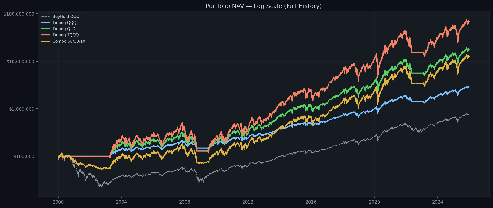
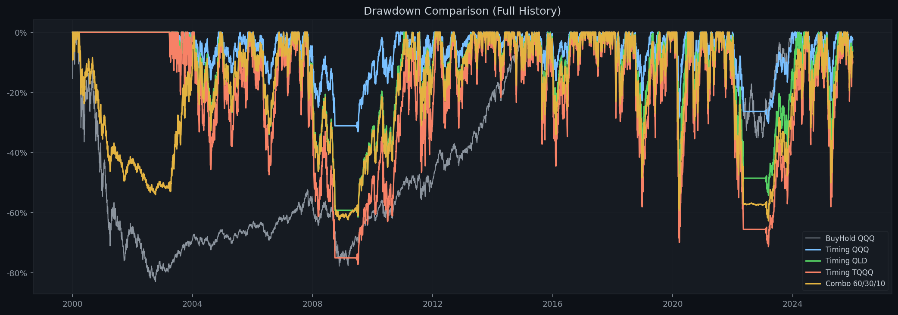
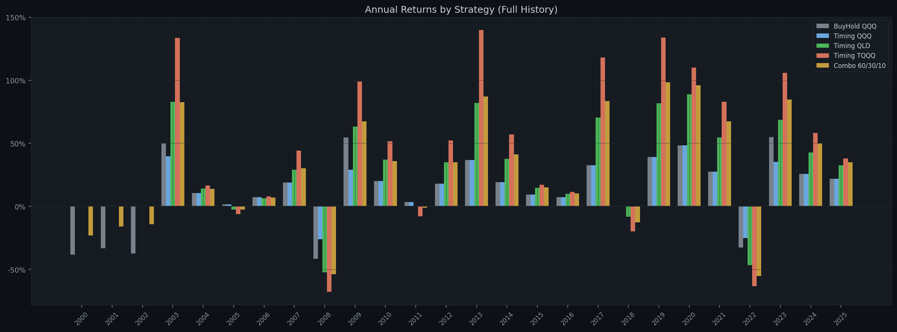
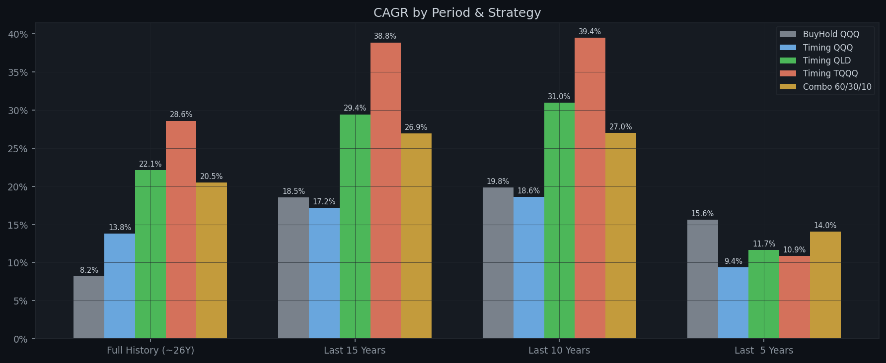
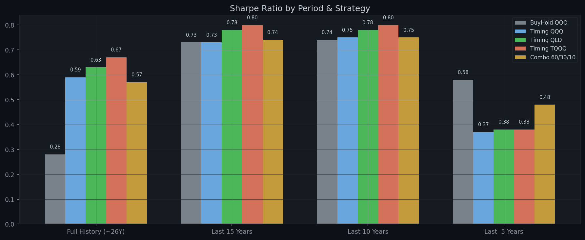

# Multi-Strategy MA200 Backtest Report

**Generated:** 2026-04-18  
**Parameters:** Buy `×1.03` | Sell `×0.83` | MA `200` | Tranches `3` | Dip `-1.0%` | Capital `$100,000`  
**Combo allocation:** QQQ 60% / QLD 30% / TQQQ 10%

---

## Performance Summary / 分周期回测结果

### Full History (~26Y)

| Strategy | Total Return | Final Value | CAGR | Max DD | Sharpe | In Market |
|---|---:|---:|---:|---:|---:|---:|
| **BuyHold QQQ** | +674.01% | $774,014 | +8.19% | -82.96% | 0.28 | 100.0% |
| **Timing QQQ** | +2779.39% | $2,879,386 | +13.80% | -33.09% | 0.59 | 82.1% |
| **Timing QLD** | +17886.82% | $17,986,822 | +22.11% | -61.50% | 0.63 | 82.1% |
| **Timing TQQQ** | +68618.82% | $68,718,822 | +28.58% | -77.26% | 0.67 | 82.1% |
| **Combo 60/30/10** | +12632.34% | $12,732,337 | +20.50% | -62.74% | 0.57 | 82.1% |

### Last 15 Years

| Strategy | Total Return | Final Value | CAGR | Max DD | Sharpe | In Market |
|---|---:|---:|---:|---:|---:|---:|
| **BuyHold QQQ** | +1176.81% | $1,276,808 | +18.52% | -35.12% | 0.73 | 100.0% |
| **Timing QQQ** | +976.70% | $1,076,702 | +17.18% | -30.29% | 0.73 | 89.5% |
| **Timing QLD** | +4672.51% | $4,772,511 | +29.42% | -54.28% | 0.78 | 89.5% |
| **Timing TQQQ** | +13590.58% | $13,690,582 | +38.84% | -71.30% | 0.80 | 89.5% |
| **Combo 60/30/10** | +3466.90% | $3,566,896 | +26.93% | -55.29% | 0.74 | 89.5% |

### Last 10 Years

| Strategy | Total Return | Final Value | CAGR | Max DD | Sharpe | In Market |
|---|---:|---:|---:|---:|---:|---:|
| **BuyHold QQQ** | +508.21% | $608,205 | +19.81% | -35.12% | 0.74 | 100.0% |
| **Timing QQQ** | +450.72% | $550,724 | +18.63% | -30.29% | 0.75 | 84.0% |
| **Timing QLD** | +1380.30% | $1,480,304 | +30.97% | -54.28% | 0.78 | 84.0% |
| **Timing TQQQ** | +2667.29% | $2,767,293 | +39.44% | -71.30% | 0.80 | 84.0% |
| **Combo 60/30/10** | +985.74% | $1,085,744 | +26.97% | -49.79% | 0.75 | 84.0% |

### Last  5 Years

| Strategy | Total Return | Final Value | CAGR | Max DD | Sharpe | In Market |
|---|---:|---:|---:|---:|---:|---:|
| **BuyHold QQQ** | +106.36% | $206,364 | +15.64% | -35.12% | 0.58 | 100.0% |
| **Timing QQQ** | +56.33% | $156,327 | +9.38% | -30.29% | 0.37 | 67.9% |
| **Timing QLD** | +73.32% | $173,320 | +11.66% | -53.92% | 0.38 | 67.9% |
| **Timing TQQQ** | +67.33% | $167,330 | +10.88% | -70.68% | 0.38 | 67.9% |
| **Combo 60/30/10** | +92.55% | $192,548 | +14.04% | -41.11% | 0.48 | 67.9% |

---

## Annual Returns (Full History) / 逐年收益

| Year | BuyHold QQQ | Timing QQQ | Timing QLD | Timing TQQQ | Combo 60/30/10 |
|---|---:|---:|---:|---:|---:|
| 2000 | -38.4% | 0.0% | 0.0% | 0.0% | -23.0% |
| 2001 | -33.3% | 0.0% | 0.0% | 0.0% | -16.0% |
| 2002 | -37.4% | 0.0% | 0.0% | 0.0% | -14.2% |
| 2003 | +49.7% | +39.8% | +82.8% | +133.4% | +82.7% |
| 2004 | +10.5% | +10.5% | +14.0% | +16.5% | +13.8% |
| 2005 | +1.6% | +1.6% | -2.5% | -6.2% | -2.5% |
| 2006 | +7.1% | +7.1% | +6.4% | +7.9% | +6.9% |
| 2007 | +19.0% | +19.0% | +29.0% | +44.1% | +30.2% |
| 2008 | -41.7% | -26.1% | -52.2% | -67.8% | -53.9% |
| 2009 | +54.7% | +29.0% | +63.3% | +99.1% | +67.3% |
| 2010 | +20.1% | +20.1% | +36.9% | +51.6% | +35.9% |
| 2011 | +3.5% | +3.5% | 0.0% | -8.0% | -1.1% |
| 2012 | +18.1% | +18.1% | +34.8% | +52.3% | +34.8% |
| 2013 | +36.6% | +36.6% | +82.1% | +139.7% | +87.2% |
| 2014 | +19.2% | +19.2% | +37.6% | +57.1% | +41.1% |
| 2015 | +9.4% | +9.4% | +14.7% | +17.2% | +15.0% |
| 2016 | +7.1% | +7.1% | +10.0% | +11.4% | +10.2% |
| 2017 | +32.7% | +32.7% | +70.3% | +118.1% | +83.4% |
| 2018 | -0.1% | -0.1% | -8.3% | -19.8% | -12.6% |
| 2019 | +39.0% | +39.0% | +81.7% | +133.8% | +98.3% |
| 2020 | +48.4% | +48.4% | +88.9% | +110.1% | +96.1% |
| 2021 | +27.4% | +27.4% | +54.7% | +83.0% | +67.5% |
| 2022 | -32.6% | -25.3% | -46.6% | -63.3% | -55.2% |
| 2023 | +54.9% | +35.2% | +68.7% | +105.9% | +84.6% |
| 2024 | +25.6% | +25.6% | +42.8% | +58.3% | +49.7% |
| 2025 | +21.8% | +21.8% | +32.6% | +37.9% | +34.9% |

---

## Charts / 图表

### NAV Comparison (Log Scale) / 净值曲线对比（对数坐标）

### Drawdown Comparison / 回撤对比

### Annual Returns by Strategy / 逐年收益柱状图

### CAGR by Period / 各时间段年化收益

### Sharpe by Period / 各时间段夏普比率

